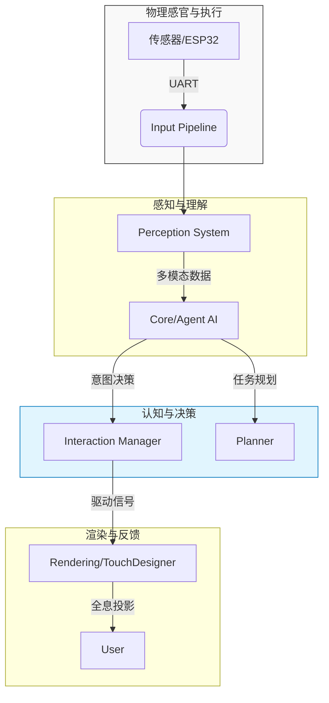

# ⬡ Project Aura: Holographic AI & HCI Research Platform
> **基于跨学科视角的全息数字生命与人机交互框架**

## 🧬 项目愿景 (Project Vision)
**Aura** 不仅仅是一个 AI 助手，它是一个探索**具身智能 (Embodied AI)**、**生成式艺术 (Generative Art)** 与**空间计算 (Spatial Computing)** 融合边界的实验性平台。

作为一名拥有美术学与心理学背景的开发者，本项目试图打破传统 GUI（图形用户界面）的冰冷感，利用传统的“佩珀尔幻象 (Pepper's Ghost)”光学原理，结合现代计算机视觉与大语言模型，赋予数字代码以“情绪感知”与“物理形态”。

## 🏗️ 系统架构 (System Architecture)
本平台采用高度解耦的模块化设计，以支持未来多模态交互的无缝接入：

## 🛠 开发方法论 (AI-Augmented Methodology)
本项目实践了前瞻性的 **AI 协同开发 (AI-Augmented Development)** 范式。
面对艺术与代码的跨学科壁垒，本人专注于**系统架构设计**、**心理学动机建模**与 **CMF（色彩/材质/细节）视觉调优**，并利用大语言模型辅助完成复杂的代码封装与底层调试，实现从艺术构思到工程落地的全流程闭环。

## 🚀 当前进展与研发日志 (Milestones & DevLog)
* **[Phase 1] 视觉协议确立 (Visual Protocol)**：成功在 `rendering/particles.py` 中实现了基于 Blender API 的粒子转换协议。将几何体转化为 8000+ 粒子的能量场，并完成了辉光 (Bloom) 参数的极客级调优。
* **[Phase 1] 核心交互雏形 (Interaction Logic)**：在 `interaction/` 模块下构建了基础的状态机与对话解析引擎。
* **[Phase 1] 智能中枢集成 (Brain Integration) —— *UPDATED!***：
  * **架构重构**：完成核心系统解耦，将大模型调用逻辑从 `agent.py` 中剥离，重构为独立模块 `core/llm_interface.py`。
  * **接口抽象**：构建统一 LLM 接口层，支持未来多模型接入与认知调度扩展。
  * **认知升级**：`agent.py` 转型为“认知调度器（Cognitive Orchestrator）”，专注决策、意图解析与记忆管理。
* **[Phase 1] 渲染系统演进 (Rendering Evolution) —— *IN PROGRESS***：

  * **技术迁移规划**：计划将粒子渲染从 Blender 迁移至 TouchDesigner。
  * **目标能力**：实现实时粒子驱动、外部信号响应（语音 / 状态 / 情绪）与更高维度的视觉交互表现。

* **[Phase 1] 感知系统扩展 (Perception Expansion) —— *NEW!***：

  * **语音模块初始化**：在 `interaction/voive_control.py` 下开始构建aura文本转语音能力。

## 🔮 未来演进 (Roadmap)
* **[Phase 1] 渲染系统演进 (Rendering Evolution) —— *IN PROGRESS***：

  * **技术迁移规划**：计划将粒子渲染从 Blender 迁移至 TouchDesigner。
  * **目标能力**：实现实时粒子驱动、外部信号响应（语音 / 状态 / 情绪）与更高维度的视觉交互表现。

* **[Phase 1] 感知系统扩展 (Perception Expansion) —— *NEW!***：

  * **语音模块初始化**：在 `perception/audio/` 下新增 `speech_to_text.py`，开始构建语音转文本（Speech-to-Text）能力。
  * **交互升级方向**：从文本输入过渡至语音输入，为具身交互提供入口。

* **[phase 2]嵌入式工程（Embedded Engineering）**

  * **研究方向**：通过整合人工智能认知、生成式视觉系统和空间计算，Aura 旨在重新定义人类在传统界面之外感知和与智能系统互动的方式。
---
> *"Art defines the soul, HCI designs the behavior, and Code builds the nervous system."*
